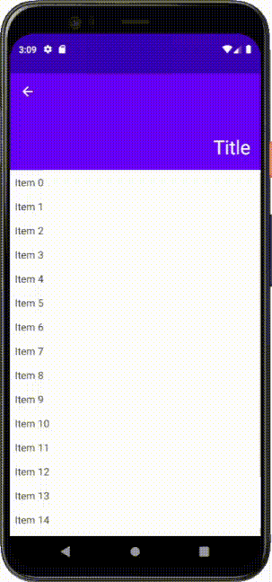

# compose-collapsing-toolbar
A simple implementation of [CollapsingToolbarLayout](https://developer.android.com/reference/com/google/android/material/appbar/CollapsingToolbarLayout) for Jetpack Compose

## Installation
You should add `mavenCentral()` repository before installation. Then add the following line to the `dependencies` block in your app level build.gradle:

```gradle
implementation "me.onebone:toolbar-compose:2.3.5"
```
or build.gradle.kts:
```kotlin
implementation("me.onebone:toolbar-compose:2.3.5")
```

## Example
An example can be found [here](app/src/main).

## Usage
### Using CollapsingToolbarScaffold
`CollapsingToolbarScaffold` is a container to help you place composables and move them as a user dispatches scroll. It provides two holes where you can place you components.
To use `CollapsingToolbarScaffold` you will need `CollapsingToolbarScaffoldState` which could be retrieved using `rememberCollapsingToolbarScaffoldState()`.
```kotlin
CollapsingToolbarScaffold(
    state = rememberCollapsingToolbarScaffoldState(), // provide the state of the scaffold
    toolbar = {
        // contents of toolbar go here...
    }
) {
    // main contents go here...
}
```

The toolbar will collapse until it gets as small as the smallest child, and will expand as large as the largest child.

Also note that the content should be scrollable for the `CollapsingToolbarScaffold` to consume nested scroll. For `LazyColumn`, you don't have to care of anything because it is scrollable by default. Column, however, is not scrollable by default so you can provide `Modifier.verticalScroll()` to make a content dispatch nested scroll.

```kotlin
CollapsingToolbarScaffold(
    state = rememberCollapsingToolbarScaffoldState(), // provide the state of the scaffold
    toolbar = {
        // contents of toolbar go here...
    }
) {
    Column(
        modifier = Modifier
            .verticalScroll(rememberScrollState()) // main content should be scrollable for CollapsingToolbarScaffold to consume nested scroll
    ) {
        // ...
    }
}
```

By default, `CollapsingToolbar` is not scrollable. In order to enable it, set `toolbarScrollable = true` in `CollapsingToolbarScaffold`.

### CollapsingToolbarScaffoldState
`CollapsingToolbarScaffoldState` is a holder of the scaffold state, such as the value of y offset and how much the toolbar has expanded. The field is public so you may use it as you need.
Note that the `CollapsingToolbarScaffoldState` is stable, which means that a change on a value of the state triggers a recomposition.
```kotlin
val state = rememberCollapsingToolbarScaffoldState()
val offsetY = state.offsetY // y offset of the layout
val progress = state.toolbarState.progress // how much the toolbar is expanded (0: collapsed, 1: expanded)

Text(
    text = "Hello World",
    textSize = (18 + (30 - 18) * progress).sp // text size depending on the progress
    // recomposed when the value of the progress is changed
)
```

## parallax, pin, road
You can tell children of CollapsingToolbar how to deal with a collapse/expansion. This works almost the same way to the `collapseMode` in the `CollapsingToolbarLayout` except for the `road` modifier.

```kotlin
CollapsingToolbar(/* ... */) {
    Image(
        modifier = Modifier.parallax(ratio = 0.2f) // parallax, pin, road are available
    )
}
```

### road modifier
The `road()` modifier allows you to place a child relatively to the toolbar. It receives two arguments: `whenCollapsed` and `whenExpanded`. As the name suggests, these describe how to place a child when the toolbar is collapsed or expanded, respectively.
This can be used to display a title text on the toolbar which is moving as the scroll is fed.
```kotlin
CollapsingToolbarScaffold(
    toolbar = {
	    Text(
            text = "Title",
            modifier = Modifier
                .road(
                    whenCollapsed = Alignment.CenterStart,
                    whenExpanded = Alignment.BottomEnd
                )
        )
    }
) {
    // ...
}
```
The above code orders the title `Text` to be placed at the _CenterStart_ position when the toolbar is collapsed and _BottomEnd_ position when it is expanded. 


## Scroll Strategy
`ScrollStrategy` defines how CollapsingToolbar consumes scroll. You can set your desired behavior by providing `scrollStrategy` to `CollapsingToolbarScaffold`:

```kotlin
CollapsingToolbarScaffold(
    /* ... */
    scrollStrategy = ScrollStrategy.EnterAlways // EnterAlways, EnterAlwaysCollapsed, ExitUntilCollapsed are available
) {
    /* ... */
}
```


### ScrollStrategy.EnterAlways


### ScrollStrategy.EnterAlwaysCollapsed


### ScrollStrategy.ExitUntilCollapsed

